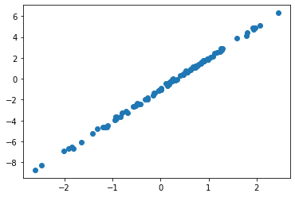
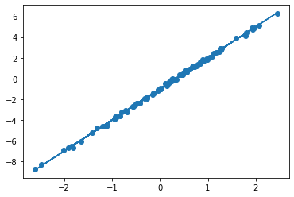

# 가속화된 NumPy인 JAX


<a href="https://colab.research.google.com/github/google/jax/blob/main/docs/jax-101/01-jax-basics.ipynb" target="_parent"></a>


*저자: Rosalia Schneider & Vladimir Mikulik*

*번역: 이태호*

*검수 : 유현아, 이영빈*

이 첫번째 섹션에서는 JAX의 기본 개념을 배울 수 있습니다.

## JAX numpy 시작하기

기본적으로 JAX는 NumPy 같은 API로 작성된 배열 조작(array-manipulating) 프로그램을 변환할 수 있는 라이브러리입니다.

이 가이드 시리즈를 통해 이것이 정확히 무엇을 의미하는지 알아보겠습니다. 지금은 JAX를 *가속기에서 실행되는 미분 가능한 NumPy*라고 생각해도 됩니다.

아래의 코드는 JAX를 가져오고 벡터를 만드는 방법을 보여줍니다.


```python
import jax
import jax.numpy as jnp

x = jnp.arange(10)
print(x)
```

    WARNING:absl:No GPU/TPU found, falling back to CPU. (Set TF_CPP_MIN_LOG_LEVEL=0 and rerun for more info.)


    [0 1 2 3 4 5 6 7 8 9]


지금까지는 모든 것이 NumPy와 동일합니다. JAX의 큰 강점은 새로운 API를 배울 필요가 없다는 것입니다. 많은 일반적인 NumPy 프로그램은 `np`를 `jnp`로 대체한 경우 JAX에서도 잘 실행됩니다. 그러나 이 섹션의 끝에서 언급할 중요한 차이점이 있습니다.

`x`의 타입을 확인하면 첫 번째 차이점을 알 수 있습니다. 이것은 JAX가 배열을 표현하는 방법인 `DeviceArray` 타입의 변수입니다.


```python
x
```


    DeviceArray([0, 1, 2, 3, 4, 5, 6, 7, 8, 9], dtype=int32)


JAX의 한 가지 유용한 기능은 동일한 코드가 CPU, GPU, TPU에서 다른 백엔드에서 실행될 수 있다는 것입니다.

다른 장치에서도 코드를 변경하지 않고 내적을 수행 할 수 있음을 보여주기 위해, 우리는 `%timeit`을 사용하여 성능을 확인할 것입니다.

(기술적인 세부 사항: JAX 함수가 호출될 때 (`jnp.array` 생성 포함) 해당 연산은 가능한 경우 가속기로 비동기적으로 처리됩니다. 따라서 반환된 배열은 함수가 바로 반환되지 않을 수 있습니다. 따라서 결과를 즉시 필요로하지 않는 경우, 이 계산은 파이썬 실행을 막지 않습니다.
그래서 `block_until_ready`를 호출하거나 배열을 일반 파이썬 타입으로 변환하지 않는 한, 우리는 실제 계산이 아닌 디스패치만 기록할 것입니다. JAX 문서의 [비동기 디스패치](https://jax.readthedocs.io/en/latest/async_dispatch.html#asynchronous-dispatch)를 확인 해보세요.


```python
long_vector = jnp.arange(int(1e7))

%timeit jnp.dot(long_vector, long_vector).block_until_ready()
```

    The slowest run took 7.39 times longer than the fastest. This could mean that an intermediate result is being cached.
    100 loops, best of 5: 7.85 ms per loop


**팁**: 위의 코드를 액셀레이터 없이 한 번, GPU 런타임으로 한 번 실행해보세요(Colab에서는 Runtime → Change Runtime Type을 클릭하고 GPU를 선택하세요). GPU에서 얼마나 빠르게 실행되는지 확인하세요.

## JAX의 첫 번째 변환: `grad`

JAX의 기본적인 기능 중 하나는 함수를 변환할 수 있다는 것입니다.

가장 많이 사용되는 변환 중 하나는 `jax.grad`입니다. 이것은 파이썬으로 작성된 수치 함수를 입력받아 원래 함수의 기울기를 계산하는 새로운 파이썬 함수를 반환합니다.

이를 사용하려면, 먼저 배열을 입력받아 제곱 합을 반환하는 함수를 정의해야 합니다.


```python
def sum_of_squares(x):
  return jnp.sum(x**2)
```

`sum_of_squares`에 `jax.grad`를 적용하면 다른 함수가 반환됩니다. 이는 곧 첫 번째 매개변수 `x`에 대한 `sum_of_squares`의 기울기입니다.

그런 다음, 그 함수를 배열에 적용하여 각 배열 요소에 대한 미분을 반환할 수 있습니다.


```python
sum_of_squares_dx = jax.grad(sum_of_squares)

x = jnp.asarray([1.0, 2.0, 3.0, 4.0])

print(sum_of_squares(x))

print(sum_of_squares_dx(x))
```

    30.0
    [2. 4. 6. 8.]


벡터 미적분학에서 $\nabla$ 연산자와 비슷하게 `jax.grad`를 생각할 수 있습니다. 함수 $f(x)$가 주어지면 $\nabla f$는 $f$의 기울기를 계산하는 함수를 나타냅니다. 즉,

$$
(\nabla f)(x)_i = \frac{\partial f}{\partial x_i}(x).
$$

비슷하게, `jax.grad(f)`는 기울기를 계산하는 함수이며, `jax.grad(f)(x)`는 `f`의 `x`에서의 기울기입니다.

($\nabla$ 과 마찬가지로 `jax.grad`는 스칼라 출력을 가진 함수에만 작동할 것입니다. 그렇지 않으면 오류가 발생합니다.)

이 점이 JAX API를 Tensorflow와 PyTorch의 다른 autodiff 라이브러리와 다르게 해줍니다. Tensorflow와 PyTorch에서는 기울기를 계산하기 위해 loss tensor 자체를 사용하지만(예를 들어 `loss.backward()`를 호출하는 것), JAX API는 함수 직접적으로 활용하여 기초 수학에 가깝습니다. 이 방식에 익숙해지면 자연스럽게 느껴지는데요. 코드에서의 손실 함수는 실제로 매개 변수와 데이터의 함수이며, 수학처럼 손실 함수의 기울기를 찾습니다.

이 방법은 미분할 변수를 제어하는 것을 쉽게하는 효과가 있습니다. 기본적으로 `jax.grad`는 첫 번째 인수에 대한 기울기를 찾습니다. 아래 예제에서 `sum_squared_error_dx`의 결과는 `x`에 대한 `sum_squared_error`의 기울기가 될 것입니다.


```python
def sum_squared_error(x, y):
  return jnp.sum((x-y)**2)

sum_squared_error_dx = jax.grad(sum_squared_error)

y = jnp.asarray([1.1, 2.1, 3.1, 4.1])

print(sum_squared_error_dx(x, y))
```

    [-0.20000005 -0.19999981 -0.19999981 -0.19999981]


기본적으로 `jax.grad`는 첫 번째 인수에 대한 기울기를 찾지만, 다른 인수(또는 여러 인수)에 대한 기울기를 찾으려면 `argnums`을 설정하면 됩니다.


```python
jax.grad(sum_squared_error, argnums=(0, 1))(x, y)  # Find gradient wrt both x & y
```


    (DeviceArray([-0.20000005, -0.19999981, -0.19999981, -0.19999981], dtype=float32),
     DeviceArray([0.20000005, 0.19999981, 0.19999981, 0.19999981], dtype=float32))


이것은 머신 러닝을 할 때 각 모델 파라미터 배열에 대한 인수를 가진 거대한 인수 목록을 가진 함수를 작성해야한다는 것을 의미할까요? 아닙니다. JAX는 'pytrees'라는 데이터 구조로 배열을 묶는 기구를 제공합니다. [다음 가이드](https://colab.research.google.com/github/google/jax/blob/main/docs/jax-101/05.1-pytrees.ipynb)에서 더 자세히 알아볼 수 있습니다. 따라서, `jax.grad`의 사용은 대게 다음과 같습니다.

```
def loss_fn(params, data):
  ...

grads = jax.grad(loss_fn)(params, data_batch)
```

`params`는 예를 들어, 배열의 중첩 딕셔너리이고, 반환된 `grads`는 같은 구조의 다른 배열의 중첩 딕셔너리입니다.

## Value 와 Grad

함수의 값과 기울기를 동시에 계산해야 할 때가 있습니다. 예를 들어, 훈련 손실을 기록하려는 경우입니다. JAX에서는 효율적으로 그것을 수행하는 간단한 변환을 제공합니다.


```python
jax.value_and_grad(sum_squared_error)(x, y)
```


    (DeviceArray(0.03999995, dtype=float32),
     DeviceArray([-0.20000005, -0.19999981, -0.19999981, -0.19999981], dtype=float32))


위 함수는 (value, grad)의 튜플을 반환합니다. 정확히는 어떤 `f`에 대해 아래와 같습니다.

```
jax.value_and_grad(f)(*xs) == (f(*xs), jax.grad(f)(*xs)) 
```

## 보조 데이터(Auxiliary data)

값을 기록하려는 것 말고도, 손실 함수를 계산하면서 얻은 중간 결과를 보고하려는 경우가 많습니다. 하지만 일반적인 `jax.grad`를 사용하여 그것을 수행하려고 하면 다음 문제가 발생합니다:


```python
def squared_error_with_aux(x, y):
  return sum_squared_error(x, y), x-y

jax.grad(squared_error_with_aux)(x, y)
```


    ---------------------------------------------------------------------------

    FilteredStackTrace                        Traceback (most recent call last)

    <ipython-input-9-7433a86e7375> in <module>()
          3 
    ----> 4 jax.grad(squared_error_with_aux)(x, y)
    

    FilteredStackTrace: TypeError: Gradient only defined for scalar-output functions. Output was (DeviceArray(0.03999995, dtype=float32), DeviceArray([-0.10000002, -0.0999999 , -0.0999999 , -0.0999999 ], dtype=float32)).
    
    The stack trace above excludes JAX-internal frames.


이것은 `jax.grad`가 스칼라 함수에서만 정의되어 있기 때문입니다. 그리고 우리의 새로운 함수가 튜플을 반환하기 때문입니다. 그러나 중간 결과를 반환하기 위해서는 튜플을 반환해야 합니다! 여기서 `has_aux`가 등장하게 됩니다:


```python
jax.grad(squared_error_with_aux, has_aux=True)(x, y)
```


    (DeviceArray([-0.20000005, -0.19999981, -0.19999981, -0.19999981], dtype=float32),
     DeviceArray([-0.10000002, -0.0999999 , -0.0999999 , -0.0999999 ], dtype=float32))


`has_aux`는 위 함수가 `(out, aux)` 쌍을 반환한다는 것을 나타냅니다. 이를 통해 `jax.grad`는 `aux`를 무시하고 사용자에게 그대로 전달하면서, 함수를 미분하며, `out`만 반환된 것처럼 작업합니다.

##  NumPy와의 차이

`jax.numpy` API는 NumPy의 API를 매우 밀접하게 따르고 있습니다. 그러나 중요한 차이점이 있습니다. 이후의 가이드에서 많은 이러한 차이점을 다룰 것이지만, 여기서 일부는 강조하는 것이 좋을 것 같습니다.

가장 중요한 차이점이며, 어떤 의미에서는 나머지 모든 차이점의 근원이라 할 수 있는 것은, JAX가 *함수형 프로그래밍*의 *함수형*으로 설계되었다는 것입니다. 그 이유는 JAX에서 가능한 프로그램 변환(program transformations)은 함수형 스타일의 프로그램에서 구현되기 더 쉽기 때문입니다.

함수형 프로그래밍에 대한 소개는 이 가이드의 범위 밖입니다. FP에 익숙하다면 JAX 학습 중에 FP 직관이 도움이 될 것입니다. 그렇지 않아도 걱정하지 마세요! JAX와 관련해서 알아야 할 기능적 프로그래밍의 중요한 특징은 매우 단순합니다. 부수 효과 (side effect)*가 있는 코드를 작성하지 마십시오.

부수 효과는 함수의 출력에 나타나지 않는 함수의 효과입니다. 배열을 자리 교체하는 것이 하나의 예입니다:

*역주: 함수형 프로그래밍에서 side effect는 부수 효과로 번역했다.


```python
import numpy as np

x = np.array([1, 2, 3])

def in_place_modify(x):
  x[0] = 123
  return None

in_place_modify(x)
x
```


    array([123,   2,   3])


부수 효과가 있는 함수는 자신의 인수를 수정하지만 완전히 관련이 없는 값을 반환합니다. 이 수정은 부수 효과입니다.

아래 코드는 NumPy로 실행됩니다. 그러나 JAX 배열은 자신을 직접(in-place) 수정하도록 허용하지 않습니다:


```python
in_place_modify(jnp.array(x))  # Raises error when we cast input to jnp.ndarray
```


    ---------------------------------------------------------------------------

    TypeError                                 Traceback (most recent call last)

    <ipython-input-12-709e2d7ddd3f> in <module>()
    ----> 1 in_place_modify(jnp.array(x))  # Raises error when we cast input to jnp.ndarray
    

    <ipython-input-11-fce65eb843c7> in in_place_modify(x)
          4 
          5 def in_place_modify(x):
    ----> 6   x[0] = 123
          7   return None
          8 


    /usr/local/lib/python3.7/dist-packages/jax/_src/numpy/lax_numpy.py in _unimplemented_setitem(self, i, x)
       6594          "or another .at[] method: "
       6595          "https://jax.readthedocs.io/en/latest/jax.ops.html")
    -> 6596   raise TypeError(msg.format(type(self)))
       6597 
       6598 def _operator_round(number, ndigits=None):


    TypeError: '<class 'jaxlib.xla_extension.DeviceArray'>' object does not support item assignment. JAX arrays are immutable. Instead of ``x[idx] = y``, use ``x = x.at[idx].set(y)`` or another .at[] method: https://jax.readthedocs.io/en/latest/_autosummary/jax.numpy.ndarray.at.html


이 오류는 고맙게도 JAX의 부수 효과가 없는 방식으로 [`jax.numpy.ndarray.at`](https://jax.readthedocs.io/en/latest/_autosummary/jax.numpy.ndarray.at.html) 인덱스 업데이트 연산자를 통해 동일한 작업을 할 수 있도록 안내합니다(주의하십시오 [`jax.ops.index_*`](https://jax.readthedocs.io/en/latest/jax.ops.html#indexed-update-functions-deprecated) 함수는 사용하지 않는 것이 좋습니다). 이것들은 인덱스에 의한 직접(in-place) 수정과 비슷하지만, 해당 수정이 적용된 새로운 배열을 생성합니다:


```python
def jax_in_place_modify(x):
  return x.at[0].set(123)

y = jnp.array([1, 2, 3])
jax_in_place_modify(y)
```


    DeviceArray([123,   2,   3], dtype=int32)


원래의 배열이 변경되지 않았으므로, 어떤 측면 효과도 없음을 참고하십시오.


```python
y
```


    DeviceArray([1, 2, 3], dtype=int32)


`부수 효과 없는 코드는 *함수적 순수* 혹은 *순수*로 불리기도 합니다.

순수 버전은 효율적이지 않을까요? 엄격히 말하면, 그렇습니다. 새 배열을 만들거든요. 하지만, 다음 가이드에서 설명할 것처럼 JAX 계산은 자주 `jax.jit`이라는 다른 프로그램 변환으로 컴파일되어 실행됩니다. 인덱스 업데이트 연산자를 사용하여 원래 배열을 직접 수정하되 이를 사용하지 않을 경우, 컴파일러가 실제로는 직접적인 수정을 컴파일 할 수 있다는 것을 인식할 수 있고, 결국 효율적인 코드를 얻을 수 있습니다.

물론 부수 효과가 있는 Python 코드와 함수적으로 순수한 JAX코드를 혼용할 수도 있습니다.  이에 대해서는 나중에 더 자세히 다룰 것입니다. JAX에 더 익숙해지면, 이것이 어떻게 작동하는지와 언제 작동하는지를 배울 수 있습니다. 그러나 경험에 의하면, JAX에서 변환할 것이라고 의도한 함수는 부수 효과를 피해야 하며, JAX의 기본 요소들 자체가 그렇게 할 수 있도록 돕습니다.

다른 곳에서 관련있는 JAX의 특이성을 설명할 것입니다. 또한 함수형 프로그래밍 스타일의 상태 관리에 중점을 둔 부분도 있습니다: [Part 7: 상태 문제](https://colab.research.google.com/github/google/jax/blob/main/docs/jax-101/07-state.ipynb). 하지만 급하다면 JAX 문서에서 [JAX - 그 효율적인 특징에 대하여](https://jax.readthedocs.io/en/latest/notebooks/Common_Gotchas_in_JAX.html)을 찾을 수 있습니다.

## 첫번째 JAX 트레이닝 루프

우리는 JAX에 대해서 아직 많이 배울 것이지만, JAX를 사용하여 간단한 트레이닝 루프를 구축하는 방법을 이해하는데 충분한 지식을 이미 알고 있습니다.

계속 간단히 하기 위해, 우리는 선형 회귀로 시작할 것입니다.

우리 데이터는 $y = w_{true} x + b_{true} + \epsilon$ 에서 추출되었습니다.


```python
import numpy as np
import matplotlib.pyplot as plt

xs = np.random.normal(size=(100,))
noise = np.random.normal(scale=0.1, size=(100,))
ys = xs * 3 - 1 + noise

plt.scatter(xs, ys);
```


    

    


따라서 우리의 모델은 $\hat y(x; \theta) = wx + b$입니다. 

두 파라미터 $w$와 $b$를 담을 수 있는 하나의 배열 `theta = [w, b]`을 사용할 것입니다.


```python
def model(theta, x):
  """Computes wx + b on a batch of input x."""
  w, b = theta
  return w * x + b
```

손실함수는 $J(x, y; \theta) = (\hat y - y)^2$ 입니다.


```python
def loss_fn(theta, x, y):
  prediction = model(theta, x)
  return jnp.mean((prediction-y)**2)
```

손실 함수를 어떻게 최적화할까요? 경사 하강법을 사용하면 됩니다. 각 업데이트 단계에서, 우리는 매개 변수에 대한 손실의 기울기를 찾고, 가장 급한 기울기 방향으로 작은 걸음을 취합니다.

$\theta_{new} = \theta - 0.1 (\nabla_\theta J) (x, y; \theta)$


```python
def update(theta, x, y, lr=0.1):
  return theta - lr * jax.grad(loss_fn)(theta, x, y)
```

JAX에서는 매 단계마다 호출되는 `update()` 함수를 정의하는 것이 일반적입니다. 이 함수는 현재 매개 변수를 입력으로 받아 새로운 매개 변수를 반환합니다. 이는 JAX 함수적 특성에 따른 자연스러운 결과이며, [상태 문제](https://colab.research.google.com/github/google/jax/blob/main/docs/jax-101/07-state.ipynb)에서 자세히 설명됩니다.

최대 효율을 위해, 이 함수 그 전체가 JIT-컴파일될 수 있습니다. 다음 가이드에서는 `jax.jit`이 어떻게 작동하는지 정확히 설명하겠지만, 만약 원한다면 `update()` 정의 전에 `@jax.jit`을 추가해보고, 아래 트레이닝 루프가 얼마나 빠르게 실행되는지 확인할 수 있습니다.


```python
theta = jnp.array([1., 1.])

for _ in range(1000):
  theta = update(theta, xs, ys)

plt.scatter(xs, ys)
plt.plot(xs, model(theta, xs))

w, b = theta
print(f"w: {w:<.2f}, b: {b:<.2f}")
```

    w: 3.00, b: -1.00


    

    


앞으로의 가이드를 통해서 보면, 이 기본 레시피는 JAX에서 구현되는 모든 트레이닝 루프의 기초가 됩니다. 이 예제와 실제 트레이닝 루프의 주요 차이점은 모델의 간단함입니다. 그것은 모든 매개 변수를 하나의 배열에 담을 수 있게 해줍니다. 나중에 [pytree 가이드](https://colab.research.google.com/github/google/jax/blob/main/docs/jax-101/05.1-pytrees.ipynb)에서는 더 많은 매개 변수를 관리하는 방법을 설명합니다. JAX에서 수동으로 간단한 MLP를 정의하고 훈련하는 방법을 보려면 지금 그 가이드로 스킵할 수 있습니다.
